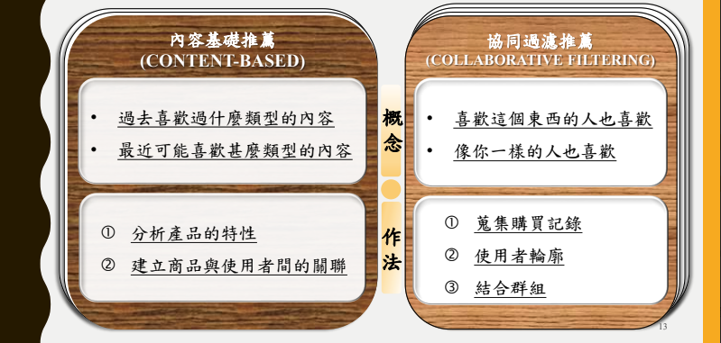

# FoodieCare

## Introduction

### Content-based Recommendation
Content-based recommendation systems focus on the properties of items. These systems suggest items similar to what a user has liked in the past, based on a comparison of content features. For example, in a movie recommendation system, if a user has watched and liked many action movies, the system will recommend other movies classified as action based on features such as genre, director, and actors. The core of content-based filtering is that it relies on the characteristics of the items themselves, making it highly personalized to the user's explicit preferences.

### Collaborative Filtering Recommendation
Collaborative filtering, on the other hand, makes recommendations based on the knowledge of users’ attitudes to items, that is, it uses the "wisdom of the crowd" to recommend items. It doesn't need to understand the content of the items. Instead, it looks for patterns of user behavior and similarities among users and items. There are two main types:

