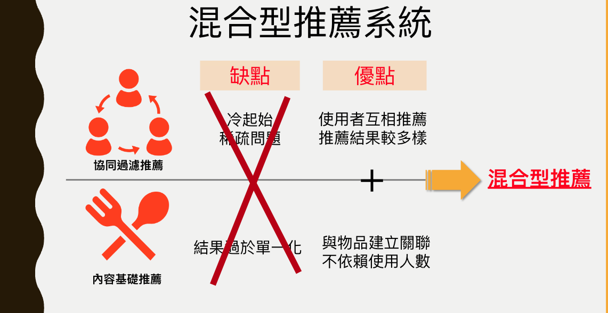
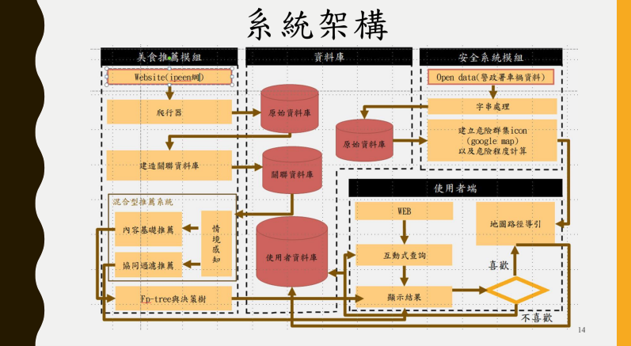
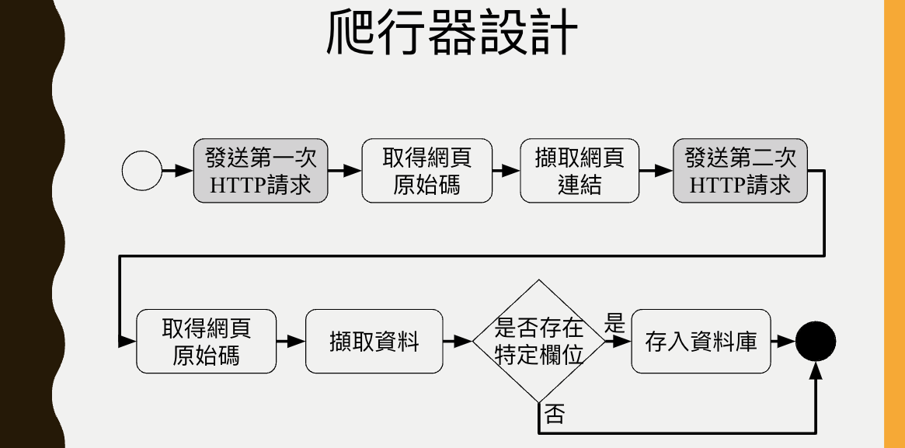
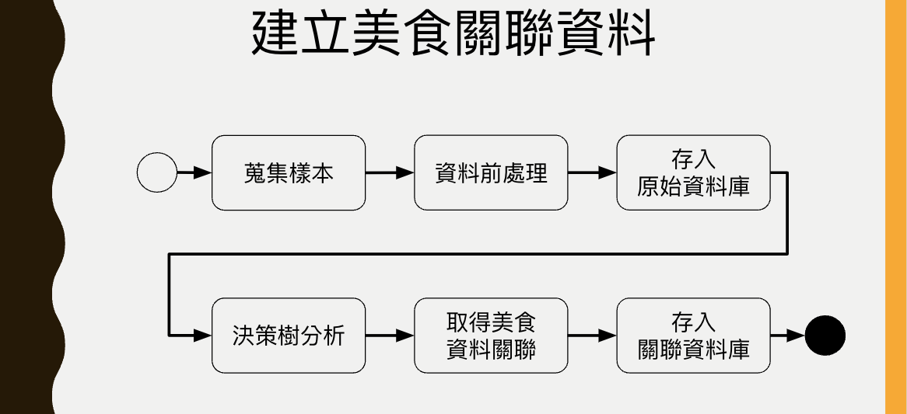
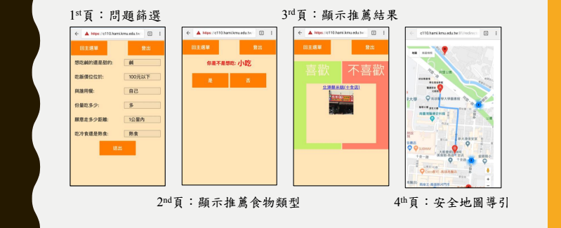
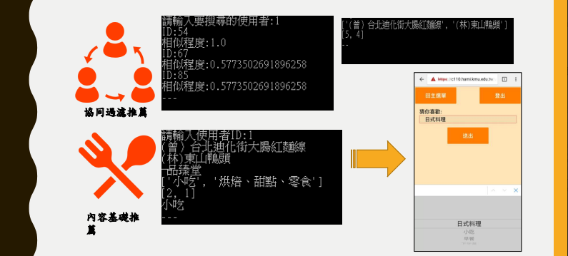

# FoodieCare

## Introduction

### Content-based Recommendation
Content-based recommendation systems focus on the properties of items. These systems suggest items similar to what a user has liked in the past, based on a comparison of content features. For example, in a movie recommendation system, if a user has watched and liked many action movies, the system will recommend other movies classified as action based on features such as genre, director, and actors. The core of content-based filtering is that it relies on the characteristics of the items themselves, making it highly personalized to the user's explicit preferences.

### Collaborative Filtering Recommendation
Collaborative filtering, on the other hand, makes recommendations based on the knowledge of users’ attitudes to items, that is, it uses the "wisdom of the crowd" to recommend items. It doesn't need to understand the content of the items. Instead, it looks for patterns of user behavior and similarities among users and items. There are two main types:

1. User-based Collaborative Filtering: This method recommends items by finding similar users. This is based on the idea that if users A and B rated items similarly, A is likely to have B's opinion on an item they haven't seen yet.

2. Item-based Collaborative Filtering: Instead of finding user's look-alike, it focuses on item similarity. If a user likes item X, then the system recommends items that other users who liked X also liked.

Both content-based and collaborative filtering recommendation models have their strengths and weaknesses. Content-based systems are limited by the need to have detailed information on the items and can only recommend items similar to those already rated by the user, potentially limiting the diversity of recommendations. Collaborative filtering can offer more serendipitous recommendations but might suffer from the cold start problem, where new items or users with limited history have few to no recommendations. Combining both approaches, often referred to as hybrid recommendation systems, can mitigate the weaknesses of each and provide more robust, personalized recommendations.

## System Architecture

### Web Crawler

### Dataflow

## Result

